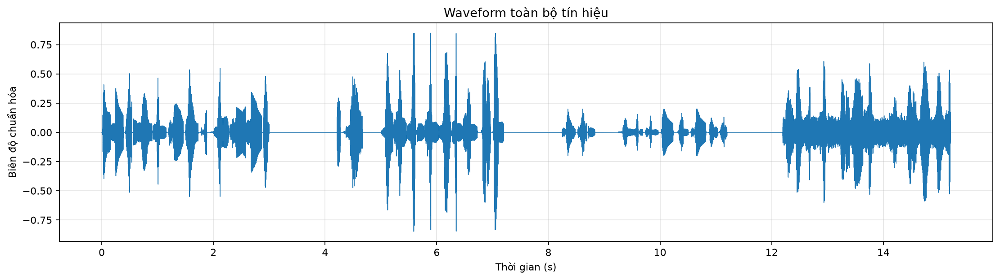
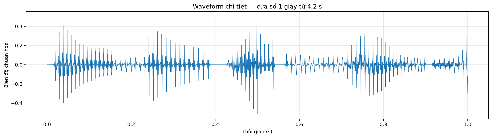
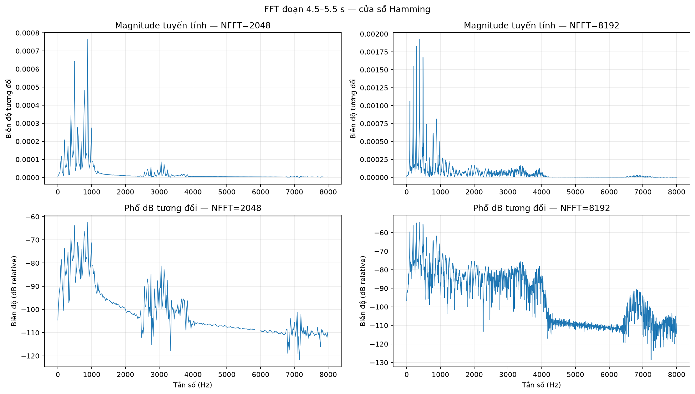
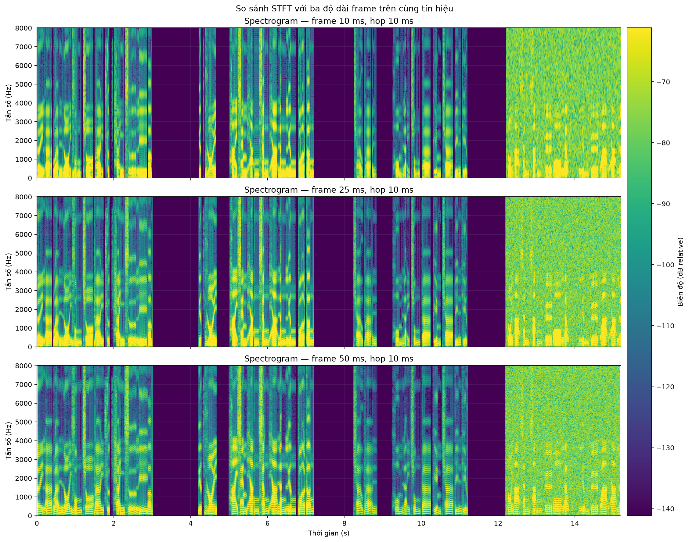
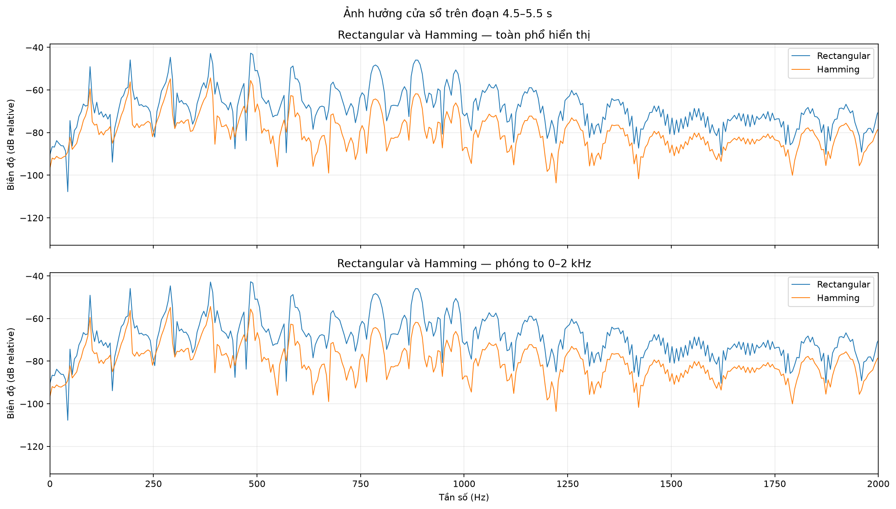
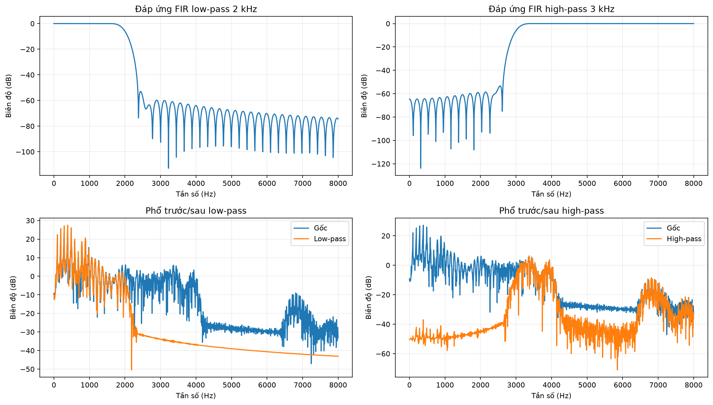
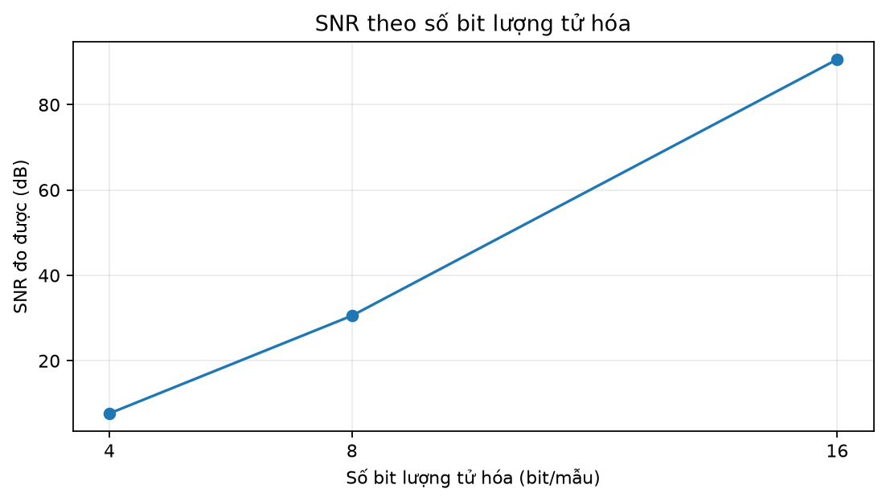
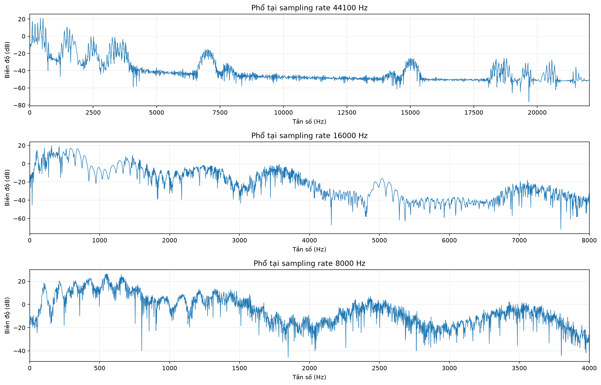

# Báo cáo Lab 01 — Phân tích và xử lý tín hiệu âm thanh số

**Họ và tên:** Lỗ Anh Việt  
**MSSV:** 2351260695  
**Học phần:** CSE457 — Xử lý âm thanh và tiếng nói

## 1. Dữ liệu và môi trường

Notebook được chạy với tệp `audio/input/generated_conversation.wav`. Chương trình tự động chọn tệp âm thanh đầu tiên trong `audio/input/`; nếu thư mục này chưa có tệp, chương trình dùng `audio/generated_conversation.wav` làm dữ liệu dự phòng.

| Thuộc tính | Giá trị |
|---|---:|
| Định dạng | WAV, PCM |
| Sampling rate | 44.100 Hz |
| Số kênh | 1 (mono) |
| Độ rộng mẫu | 16 bit/mẫu |
| Thời lượng | 15,2 s |
| Số mẫu trên mỗi kênh | 670.320 |
| Kích thước tệp | 1.340.684 byte |
| PCM bit rate lý thuyết | 705,6 kbps |

Tín hiệu được đổi sang `float64` và chuẩn hóa về miền `[-1, 1]`. Tệp thử nghiệm đã là mono nên không cần trộn hai kênh; notebook vẫn có mã xử lý stereo bằng trung bình các kênh.

## 2. Phân tích miền thời gian



*Hình 1. Waveform toàn bộ tệp; tín hiệu mono 44,1 kHz, biên độ đã chuẩn hóa về `[-1, 1]`, trục ngang là thời gian (s).*



*Hình 2. Waveform chi tiết trong cửa sổ 1 s đầu của đoạn nói lớn (4,2–5,2 s); trục dọc là biên độ chuẩn hóa.*

Các đại lượng đo trên toàn tệp:

| Đại lượng | Giá trị |
|---|---:|
| Peak | 0,849976 |
| RMS | 0,062291 |
| Energy `Σx²[n]` | 2600,96 |

Các đoạn có đặc tính khác nhau:

| Đoạn | Khoảng thời gian | Peak | RMS | Energy |
|---|---:|---:|---:|---:|
| Nói lớn | 4,2–7,2 s | 0,849976 | 0,091347 | 1103,94 |
| Nói nhỏ | 8,2–11,2 s | 0,199982 | 0,022787 | 68,69 |
| Nói kèm white noise | 12,2–15,2 s | 0,607391 | 0,083190 | 915,59 |

Peak nhỏ hơn 1 nên không phát hiện clipping. Đoạn nói lớn có RMS và năng lượng cao hơn đoạn nói nhỏ; đoạn cuối có nền năng lượng và biến thiên phổ rộng hơn do white noise.

## 3. FFT và phân tích miền tần số

Đoạn 4,5–5,5 s được nhân cửa sổ Hamming. Hai giá trị FFT được dùng là `NFFT = 2048` và `NFFT = 8192`:

| NFFT | `Δf = Fs/NFFT` |
|---:|---:|
| 2048 | 21,533 Hz |
| 8192 | 5,383 Hz |



*Hình 3. Phổ FFT đoạn 4,5–5,5 s với cửa sổ Hamming; hàng trên là biên độ tuyến tính, hàng dưới là dB tương đối, hiển thị đến 8 kHz. Các tham số NFFT được ghi trên từng panel.*

Các đỉnh phổ nổi bật được phát hiện quanh 193,8 Hz, 387,6 Hz, 495,3 Hz và 882,9 Hz. Tăng NFFT làm các điểm trên trục tần số dày hơn và giảm khoảng cách giữa các frequency bin; nó không tự tạo thêm thông tin hay tăng true resolution khi độ dài frame không đổi.

## 4. STFT và spectrogram



*Hình 4. Spectrogram của toàn bộ tệp 0–15,2 s, cửa sổ Hamming, hop 10 ms, `NFFT = 4096`; ba panel lần lượt dùng frame 10/25/50 ms và chung thang màu dB tương đối để so sánh công bằng.*

Frame 10 ms bám biến đổi nhanh theo thời gian tốt hơn nhưng độ phân giải tần số kém hơn. Frame 50 ms cho dải tần sắc hơn nhưng làm transient bị nhòe. Cấu hình chuẩn của bài là frame 25 ms và hop 10 ms. Vì spectrogram dùng toàn bộ tệp nên vùng white noise từ khoảng 12 s cũng được đưa vào phân tích.

## 5. Thí nghiệm cửa sổ



*Hình 5. So sánh rectangular và Hamming trên cùng đoạn 4,5–5,5 s, cùng `NFFT = 8192`; panel dưới phóng to 0–2 kHz. Trục dọc là biên độ dB tương đối.*

Hamming làm side-lobe nhỏ hơn nên giảm spectral leakage, nhưng main-lobe rộng hơn rectangular. Vì dữ liệu, frame và NFFT được giữ nguyên, khác biệt quan sát được chủ yếu do loại cửa sổ.

## 6. Lọc số FIR

Hai bộ lọc FIR đối xứng 201 taps, cửa sổ Hamming, được thiết kế tại `Fs = 44.100 Hz`:

- Low-pass cutoff 2 kHz: [`audio/output/speech_lpf_2k.wav`](audio/output/speech_lpf_2k.wav).
- High-pass cutoff 3 kHz: [`audio/output/speech_hpf_3k.wav`](audio/output/speech_hpf_3k.wav).

Năm hệ số đầu của hai vector hệ số (toàn bộ vector 201 hệ số được tạo lại khi chạy notebook) là:

| Bộ lọc | `b[0:5]` |
|---|---|
| Low-pass | `[-5,5690e-05; 1,6500e-05; 8,9740e-05; 1,5924e-04; 2,2009e-04]` |
| High-pass | `[2,4075e-04; 2,5670e-04; 2,2754e-04; 1,5634e-04; 5,2990e-05]` |



*Hình 6. Đáp ứng tần số `H(f)` của low-pass/high-pass và phổ trước–sau lọc trên cùng đoạn phân tích; trục ngang là Hz, trục dọc là biên độ dB.*

Độ trễ nhóm lý thuyết của FIR đối xứng là `(201−1)/2 = 100` mẫu, tương đương `2,27 ms`. Low-pass làm suy giảm thành phần cao tần nên âm thanh nghe tối hơn; high-pass loại bỏ phần thấp tần, phù hợp với đáp ứng `H(f)` và phổ sau lọc.

## 7. Lượng tử hóa, resampling và mã hóa

### 7.1. Lượng tử hóa

| Số bit | Số mức | SNR đo được |
|---:|---:|---:|
| 4 | 16 | 7,65 dB |
| 8 | 256 | 30,56 dB |
| 16 | 65.536 | 90,61 dB |



*Hình 7. SNR đo được theo số bit lượng tử hóa; trục dọc là SNR (dB), không phải dBFS.*

Các tệp lượng tử hóa được lưu trong `audio/output/` với tên `speech_quantized_4bit.wav`, `speech_quantized_8bit.wav` và `speech_quantized_16bit.wav`. Chúng được lưu trong container WAV PCM16 để dễ phát lại; phép tính SNR dùng giá trị lượng tử hóa tương ứng 4/8/16 bit trước khi ghi tệp.

### 7.2. Resampling

Resampling dùng `scipy.signal.resample_poly`, có lọc chống aliasing trước khi giảm tần số lấy mẫu.

- [`audio/output/speech_16000Hz.wav`](audio/output/speech_16000Hz.wav), Nyquist 8 kHz.
- [`audio/output/speech_8000Hz.wav`](audio/output/speech_8000Hz.wav), Nyquist 4 kHz.



*Hình 8. So sánh phổ ở sampling rate gốc 44,1 kHz, 16 kHz và 8 kHz; trục ngang là tần số (Hz), trục dọc là biên độ dB tương đối.*

Khi giảm sampling rate, dải tần biểu diễn được thu hẹp theo Nyquist; các thành phần trên Nyquist phải được lọc trước để tránh aliasing.

### 7.3. Mã hóa và compression ratio

Với tín hiệu mono 44.100 Hz, 16 bit:

```text
R_PCM = 44.100 × 16 × 1 = 705.600 bit/s = 705,6 kbps
Size_PCM ≈ 705.600 × 15,2 / 8 = 1.340.640 byte ≈ 1,341 MB
```

File MP3 128 kbps [`audio/output/speech_compressed_128kbps.mp3`](audio/output/speech_compressed_128kbps.mp3) có kích thước thực tế khoảng 0,244 MB và bitrate đo được khoảng 128,5 kbps. Do đó, compression ratio PCM/MP3 xấp xỉ `705,6 / 128,5 = 5,49:1`.

## 8. Trả lời câu hỏi báo cáo

1. Theo định lý Nyquist, tín hiệu lấy mẫu ở `Fs` chỉ biểu diễn độc lập các thành phần đến `Fs/2`. Với `Fs = 44,1 kHz`, giới hạn Nyquist là `22,05 kHz`; thành phần cao hơn có thể alias xuống dải thấp.

2. Khi tăng NFFT từ 2048 lên 8192, khoảng cách các điểm trên trục tần số giảm bốn lần nên phổ được nội suy dày hơn. True resolution vẫn chủ yếu do độ dài frame 25 ms và loại cửa sổ quyết định; zero-padding không tạo thêm thông tin đo được.

3. Rectangular có discontinuity lớn ở biên frame nên side-lobe cao và leakage mạnh. Hamming làm side-lobe giảm, nhưng main-lobe rộng hơn, vì vậy hai đỉnh gần nhau có thể khó tách hơn.

4. Với FIR 201 taps đối xứng, group delay là 100 mẫu. Ở 44,1 kHz, `100/44100 ≈ 2,27 ms`. Độ trễ này nhỏ và thường chấp nhận được trong xử lý thời gian thực, nhưng cần tính đến khi ghép nhiều tầng lọc hoặc yêu cầu độ trễ rất thấp.

5. `SNR_Q = 10 log10(Σx² / Σe²)`. Tăng số bit làm bước lượng tử nhỏ hơn nên nhiễu lượng tử giảm và SNR tăng gần 6 dB/bit trong điều kiện lý tưởng. Nếu giảm RMS tín hiệu nhưng giữ nguyên miền lượng tử, công suất tín hiệu giảm trong khi nhiễu lượng tử gần như không đổi nên SNR giảm.

6. WAV 16-bit stereo 44,1 kHz dài 60 s có kích thước PCM lý thuyết `44.100 × 16 × 2 × 60 / 8 = 10.584.000 byte ≈ 10,584 MB`. MP3 128 kbps dài 60 s có khoảng `128.000 × 60 / 8 = 960.000 byte ≈ 0,96 MB`, tương đương compression ratio lý thuyết `1411,2/128 ≈ 11,03:1`.

7. “Nghe tốt hơn” không nhất thiết đồng nghĩa với SNR lớn hơn. Ví dụ: (i) nhiễu ngoài dải nghe hoặc ở vùng tai kém nhạy có thể làm SNR thấp nhưng ít khó chịu; (ii) bộ lọc loại bỏ thành phần gây chói có thể nghe dễ chịu hơn dù sai số năng lượng tăng; (iii) hai tín hiệu có cùng SNR nhưng một tín hiệu bị clipping/transient khó chịu hơn tín hiệu còn lại.

## 9. Kết luận

Notebook đã triển khai đầy đủ pipeline A→G bằng mã có thể chạy lại: đọc và chuẩn hóa audio, phân tích waveform/FFT/STFT, so sánh cửa sổ và frame, thiết kế FIR, lượng tử hóa, resampling và mã hóa. Báo cáo kèm bảng số liệu, hình có tiêu đề–trục–đơn vị, audio đầu ra và các nhận xét gắn với dấu hiệu quan sát được trên đồ thị.
