# Lab 2 — Đặc trưng tiếng nói và nhận dạng bằng DTW

**Sinh viên:** Lỗ Anh Việt — **MSSV:** 2351260695

## 1. Dữ liệu và phạm vi kết quả

Dữ liệu WAV do người dùng cung cấp. Cần ghi rõ người nói, thiết bị và môi trường thu trong báo cáo.

Bộ dữ liệu: `dataset`; 5 lớp, 25 file; 15 template và 10 test.

Chia theo tên file đã sắp xếp: 3 file đầu/lớp là train, phần còn lại là test. Danh sách được lưu ở `split.json`; dùng cùng split cho baseline, E1 và E2.

File có mẫu gần clipping (|x| ≥ 0,999): 0. File đúng WAV mono PCM 16 kHz ban đầu: 25/25. Pipeline chuyển mono và resample khi cần; bảng kiểm tra trong notebook dùng dữ liệu trước chuẩn hóa.

## 2. Cấu hình và thuật toán

| Tham số | Giá trị |
|---|---|
| sr | 16000 |
| frame | 400 |
| hop | 160 |
| n_fft | 512 |
| n_mels | 24 |
| n_mfcc | 13 |
| alpha | 0.97 |
| top_db | 35.0 |
| endpoint_method | adaptive |
| noise_window_ms | 200.0 |
| noise_on_db | 8.0 |
| noise_off_db | 3.0 |
| smooth_ms | 30.0 |
| min_speech_ms | 40.0 |
| max_gap_ms | 80.0 |
| margin_ms | 200.0 |
| endpoint | True |
| delta | False |
| cmn | True |

Frame 400 mẫu, hop 160 mẫu, Hamming; frame cuối thiếu mẫu được zero-pad. FFT được padding riêng lên 512. Mel dùng 1125 ln(1+f/700), 24 bộ lọc tam giác. DCT-II trực chuẩn, giữ c0–c12; CMN theo từng utterance. Khoảng cách Euclid, DTW ba bước; tối ưu tổng chi phí rồi chia độ dài path.

## 3. Energy, ZCR, endpoint và autocorrelation

Energy/RMS đo mức biên độ; ZCR đếm đổi dấu trên cửa sổ chữ nhật. Silence thường có energy thấp; voiced thường có energy cao và ZCR thấp hơn unvoiced. ZCR cao cũng có thể do nhiễu nên không dùng riêng làm điều kiện xác định speech.

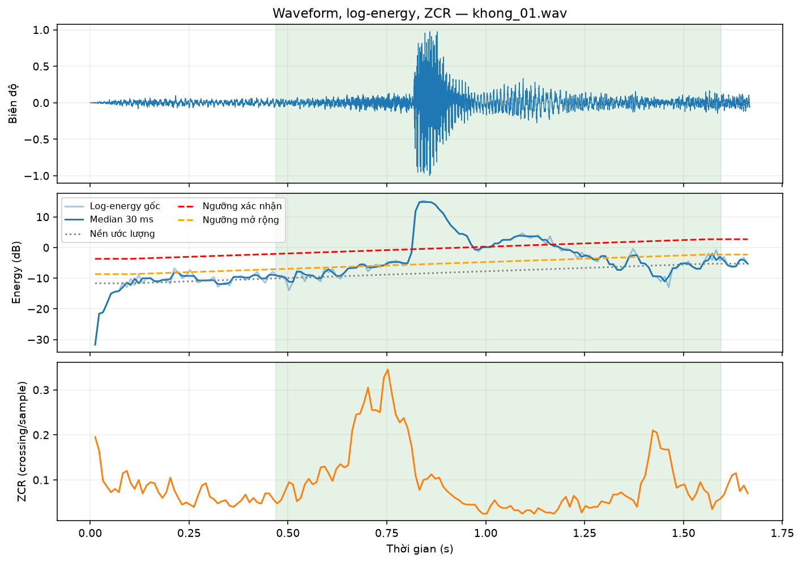

*Hình 1. Waveform, log-energy và ZCR của tệp khong_01.wav; tín hiệu mono 16 kHz, frame 25 ms, hop 10 ms. Ba panel lần lượt là biên độ chuẩn hóa, log-energy (dB) cùng mức nền/ngưỡng endpoint, và ZCR (crossing/sample); trục ngang là thời gian (s), vùng xanh là đoạn được giữ lại.*

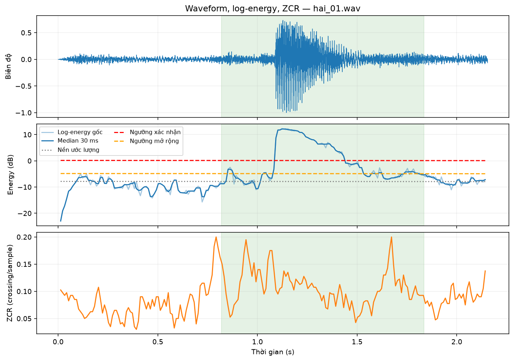

*Hình 2. Waveform, log-energy và ZCR của tệp hai_01.wav; tín hiệu mono 16 kHz, frame 25 ms, hop 10 ms. Ba panel lần lượt là biên độ chuẩn hóa, log-energy (dB) cùng mức nền/ngưỡng endpoint, và ZCR (crossing/sample); trục ngang là thời gian (s), vùng xanh là đoạn được giữ lại.*

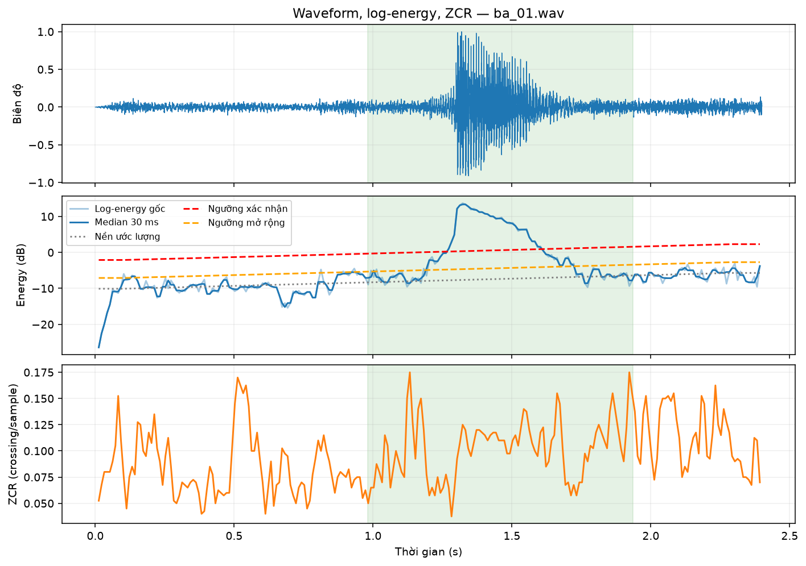

*Hình 3. Waveform, log-energy và ZCR của tệp ba_01.wav; tín hiệu mono 16 kHz, frame 25 ms, hop 10 ms. Ba panel lần lượt là biên độ chuẩn hóa, log-energy (dB) cùng mức nền/ngưỡng endpoint, và ZCR (crossing/sample); trục ngang là thời gian (s), vùng xanh là đoạn được giữ lại.*

Endpoint `adaptive` ước lượng nền bằng median log-energy ở 200 ms đầu/cuối, nội suy nền theo thời gian để theo thay đổi gain chậm. Làm trơn median 30 ms; ngưỡng xác nhận = nền + 8 dB, ngưỡng mở rộng = nền + 3 dB. Cần ít nhất 40 ms liên tiếp trên ngưỡng xác nhận; nối khoảng ngắt ≤ 80 ms, chọn vùng có đỉnh tương phản nền lớn nhất. Giữ margin 200 ms mỗi phía; chưa dùng ZCR tinh chỉnh. Xem/nghe các file khong và hai đã trim để kiểm tra phụ âm năng lượng thấp. Không thể kết luận giữ đủ phụ âm chỉ từ thời lượng.

| File | Trước (s) | Sau (s) |
|---|---:|---:|
| khong/khong_01.wav | 1.667 | 1.125 |
| khong/khong_02.wav | 1.900 | 1.365 |
| khong/khong_03.wav | 2.057 | 1.265 |
| mot/mot_01.wav | 1.844 | 0.745 |
| mot/mot_02.wav | 1.750 | 0.755 |
| mot/mot_03.wav | 1.852 | 0.955 |
| hai/hai_01.wav | 2.154 | 1.015 |
| hai/hai_02.wav | 1.738 | 0.955 |
| hai/hai_03.wav | 2.047 | 0.925 |
| ba/ba_01.wav | 2.400 | 0.955 |
| ba/ba_02.wav | 1.733 | 0.885 |
| ba/ba_03.wav | 1.823 | 1.015 |
| bon/bon_01.wav | 1.922 | 0.855 |
| bon/bon_02.wav | 2.033 | 1.395 |
| bon/bon_03.wav | 2.300 | 1.710 |
| khong/khong_04.wav | 1.786 | 0.955 |
| khong/khong_05.wav | 2.400 | 0.975 |
| mot/mot_04.wav | 1.724 | 0.725 |
| mot/mot_05.wav | 1.976 | 0.795 |
| hai/hai_04.wav | 2.029 | 1.225 |
| hai/hai_05.wav | 2.370 | 0.975 |
| ba/ba_04.wav | 2.143 | 1.205 |
| ba/ba_05.wav | 1.899 | 1.005 |
| bon/bon_04.wav | 1.870 | 1.075 |
| bon/bon_05.wav | 2.000 | 0.805 |

Với cấu hình này, 0/25 file giữ nguyên thời lượng sau endpoint.

Đã cắt nền ở 25/25 file; thời lượng loại bỏ trung bình 0.950 s/file. Có 0 file fallback giữ nguyên do chưa xác nhận được speech/clip quá ngắn.

So sánh trực tiếp với endpoint cũ (đỉnh trừ 35 dB, margin 50 ms) trong bảng endpoint của notebook và cột `relative_35db_after_s` ở `endpoint.csv`. Tham số endpoint mới được chọn bằng kiểm tra biên trên 15 file train; giữ cố định trước khi chạy đánh giá 10 file test. Điểm test không dùng để chọn ngưỡng.

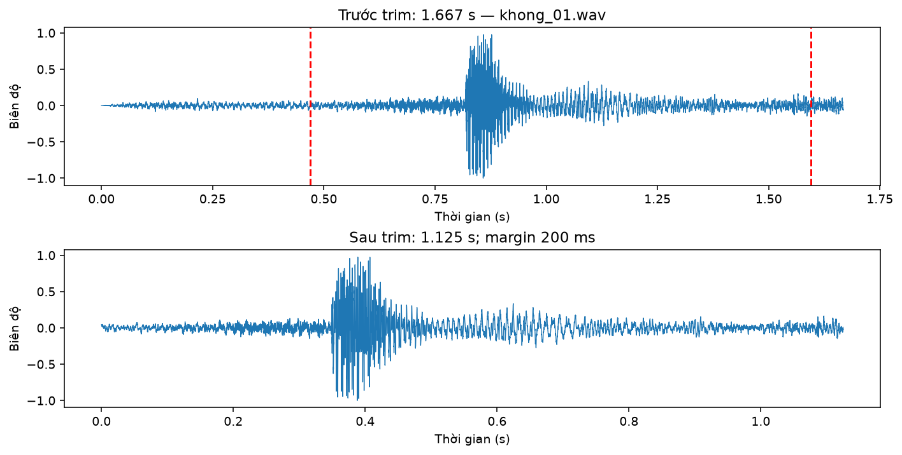

*Hình 4. So sánh waveform trước và sau endpoint của tệp khong_01.wav; hai vạch đỏ đánh dấu biên cắt, giữ đệm 200 ms mỗi phía. Panel trên là tín hiệu gốc, panel dưới là đoạn đã cắt với gốc thời gian mới; trục ngang là thời gian (s), trục dọc là biên độ chuẩn hóa.*

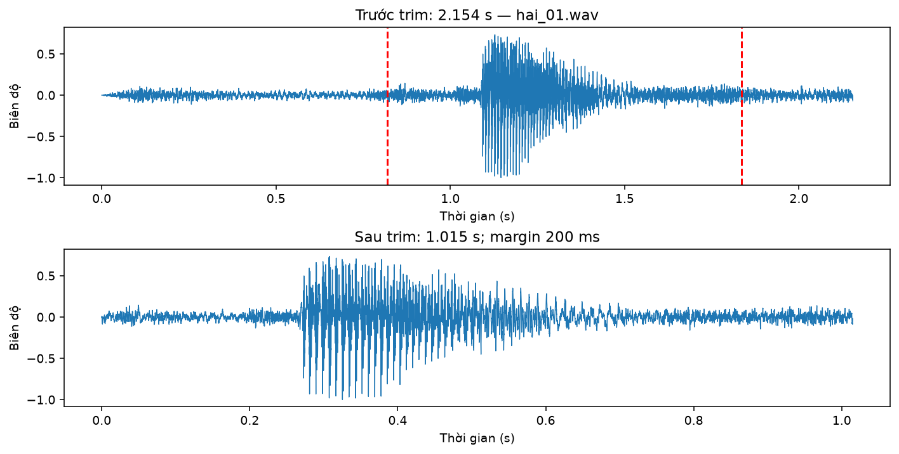

*Hình 5. So sánh waveform trước và sau endpoint của tệp hai_01.wav; hai vạch đỏ đánh dấu biên cắt, giữ đệm 200 ms mỗi phía. Panel trên là tín hiệu gốc, panel dưới là đoạn đã cắt với gốc thời gian mới; trục ngang là thời gian (s), trục dọc là biên độ chuẩn hóa.*

Autocorrelation minh họa: file ba_01.wav, lag 154 mẫu, F0 ≈ 103.9 Hz, đỉnh chuẩn hóa 0.252. Ước lượng trên frame energy lớn nhất trong miền 70–400 Hz; có thể nhầm bội/ước pitch, không dùng pitch làm đầu vào recognizer.

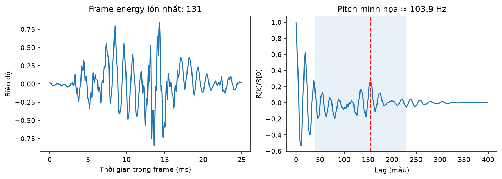

*Hình 6. Frame có energy lớn nhất của tệp ba_01.wav và tự tương quan ngắn hạn; panel trái biểu diễn frame đã bỏ DC và nhân Hamming theo thời gian (ms), panel phải biểu diễn R[k]/R[0] theo lag (mẫu). Tìm đỉnh trong miền 70–400 Hz, lag 154 mẫu cho F0 xấp xỉ 103.9 Hz.*

## 4. MFCC và DTW

Mỗi frame luôn có 13 hệ số; số frame phụ thuộc độ dài từ sau trim. Cấu trúc màu theo thời gian của heatmap phản ánh biến thiên đường bao phổ.

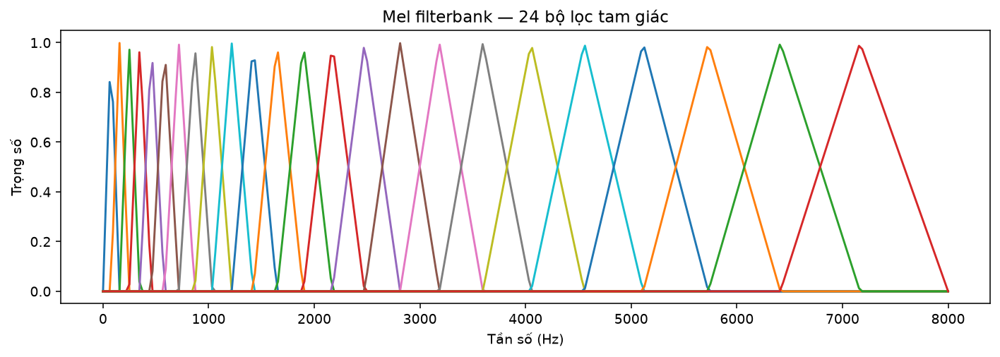

*Hình 7. Mel filterbank gồm 24 bộ lọc tam giác tại Fs = 16 kHz và NFFT = 512; trục ngang là tần số (Hz), trục dọc là trọng số. Khoảng cách theo Hz giữa các bộ lọc tăng dần ở vùng tần số cao.*

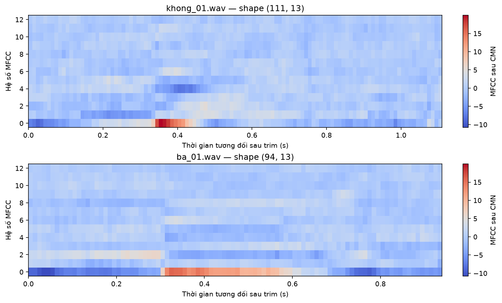

*Hình 8. Heatmap MFCC của các tệp khong_01.wav, ba_01.wav; mỗi frame có 13 hệ số và đã chuẩn hóa trung bình cepstral (CMN). Trục ngang là thời gian tương đối sau trim (s), trục dọc là chỉ số hệ số; các panel dùng chung thang màu.*

| Cặp so sánh | Frames X/Y | Path length | DTW_norm |
|---|---:|---:|---:|
| same_word | 111/135 | 143 | 7.8919 |
| different_word | 111/94 | 113 | 7.8620 |

Ở cặp minh họa này, score cùng từ lớn hơn hoặc bằng score khác từ. Do đó không thể dùng riêng hai cặp này để kết luận cùng từ luôn gần hơn. Nên kiểm tra biến thiên phát âm, vùng nền và biên speech; không tự thay cặp minh họa hoặc chọn lại split để làm đẹp kết quả.

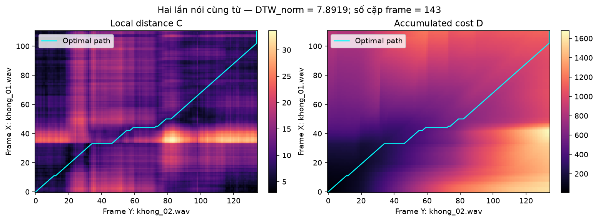

*Hình 9. Hai lần nói cùng từ: căn chỉnh DTW giữa khong_01.wav và khong_02.wav; panel trái là ma trận khoảng cách Euclid cục bộ C, panel phải là chi phí tích lũy D. Đường xanh cyan là đường đi tối ưu; trục ngang là chỉ số frame Y, trục dọc là chỉ số frame X. DTW_norm và số cặp frame trên đường đi được ghi trên hình.*

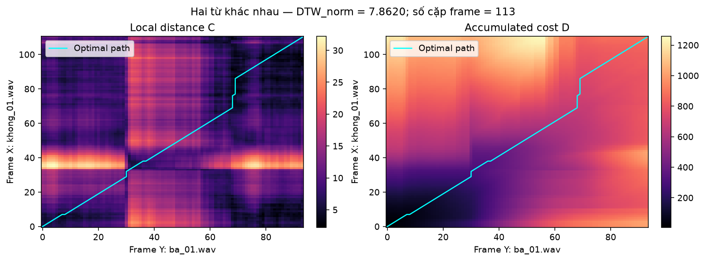

*Hình 10. Hai từ khác nhau: căn chỉnh DTW giữa khong_01.wav và ba_01.wav; panel trái là ma trận khoảng cách Euclid cục bộ C, panel phải là chi phí tích lũy D. Đường xanh cyan là đường đi tối ưu; trục ngang là chỉ số frame Y, trục dọc là chỉ số frame X. DTW_norm và số cặp frame trên đường đi được ghi trên hình.*

Hai chuỗi có độ dài khác nhau nên đường đi có thể lệch đường chéo hình học. Bước ngang/dọc biểu diễn kéo giãn theo thời gian; không bảo đảm mọi cặp cùng từ đều có chi phí nhỏ hơn mọi cặp khác từ.

## 5. Nhận dạng và thí nghiệm E1–E2

Mỗi nhãn lấy khoảng cách nhỏ nhất trong 3 template; chọn nhãn có score thấp nhất. Top-3 là ba nhãn, không phải ba template. Không áp dụng reject unknown.

| Thí nghiệm | Endpoint | Số chiều | Đúng/test | Accuracy |
|---|---|---:|---:|---:|
| baseline | True | 13 | 8/10 | 80.0% |
| E1_no_endpoint | False | 13 | 7/10 | 70.0% |
| E2_mfcc_delta | True | 26 | 8/10 | 80.0% |

Đối chiếu với lần chạy endpoint cũ trên cùng WAV/split và cấu hình MFCC:

| Cấu hình | Endpoint cũ | Endpoint mới | Thay đổi (điểm %) |
|---|---:|---:|---:|
| baseline | 70.0% | 80.0% | +10.0 |
| E1_no_endpoint | 70.0% | 70.0% | +0.0 |
| E2_mfcc_delta | 90.0% | 80.0% | -10.0 |

Trim loại vùng nền làm thay đổi MFCC, CMN và Δ theo thời gian. Giảm thời lượng không bảo đảm mọi cấu hình nhận dạng đều tốt hơn; giữ nguyên các kết quả tăng/giảm và không chọn lại ngưỡng bằng test. `endpoint_reference.json` lưu số đo cũ và hash WAV; chỉ tạo bảng đối chứng khi dữ liệu và cấu hình feature còn khớp.

E1 bỏ endpoint: accuracy thay đổi -10.0 điểm phần trăm so với baseline. E2 thêm Δ: thay đổi +0.0 điểm phần trăm. Feature được tính lại cho cả template và test trong từng cấu hình; E2 dùng đạo hàm Savitzky–Golay qua Librosa, cửa sổ tối đa 9 frame.

Cùng accuracy không đồng nghĩa cùng dự đoán; đối chiếu results_all.csv. Tập test nhỏ nên chưa đủ suy rộng về độ chính xác trên người nói mới.

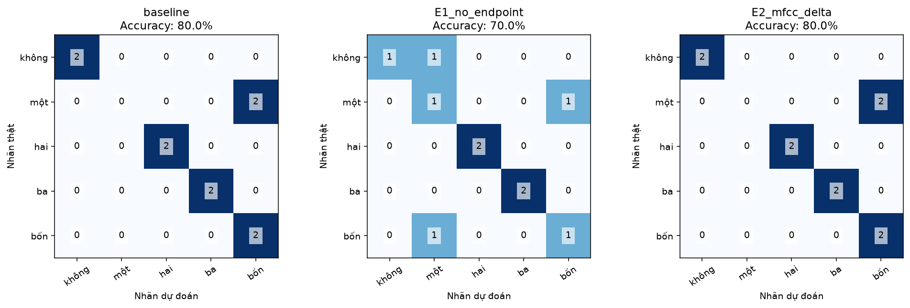

*Hình 11. Ma trận nhầm lẫn của baseline, E1 không endpoint và E2 MFCC + Δ trên cùng 10 file test; trục ngang là nhãn dự đoán, trục dọc là nhãn thật, số trong mỗi ô là số mẫu. Accuracy của từng cấu hình được ghi phía trên mỗi panel.*

Nhầm có hướng nhiều nhất: **một → bốn**, 2 mẫu. Cần nghe lại, kiểm tra biên trim và đối chiếu waveform/MFCC/path; chưa thể khẳng định nguyên nhân chỉ từ confusion matrix.

| File lỗi | Nhãn thật | Dự đoán | Top-1 score |
|---|---|---|---:|
| mot/mot_04.wav | mot | bon | 4.8933 |
| mot/mot_05.wav | mot | bon | 4.8275 |

Các hình dưới phân tích mẫu lỗi đầu tiên: waveform/energy/ZCR, MFCC so với hai nhãn và DTW tới template gần nhất của từng nhãn.

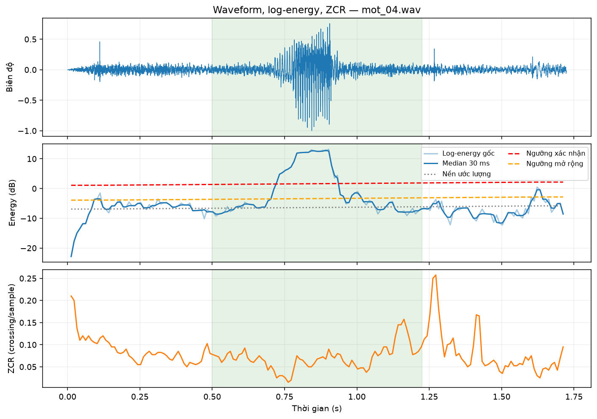

*Hình 12. Waveform, log-energy và ZCR của tệp mot_04.wav; tín hiệu mono 16 kHz, frame 25 ms, hop 10 ms. Ba panel lần lượt là biên độ chuẩn hóa, log-energy (dB) cùng mức nền/ngưỡng endpoint, và ZCR (crossing/sample); trục ngang là thời gian (s), vùng xanh là đoạn được giữ lại.*

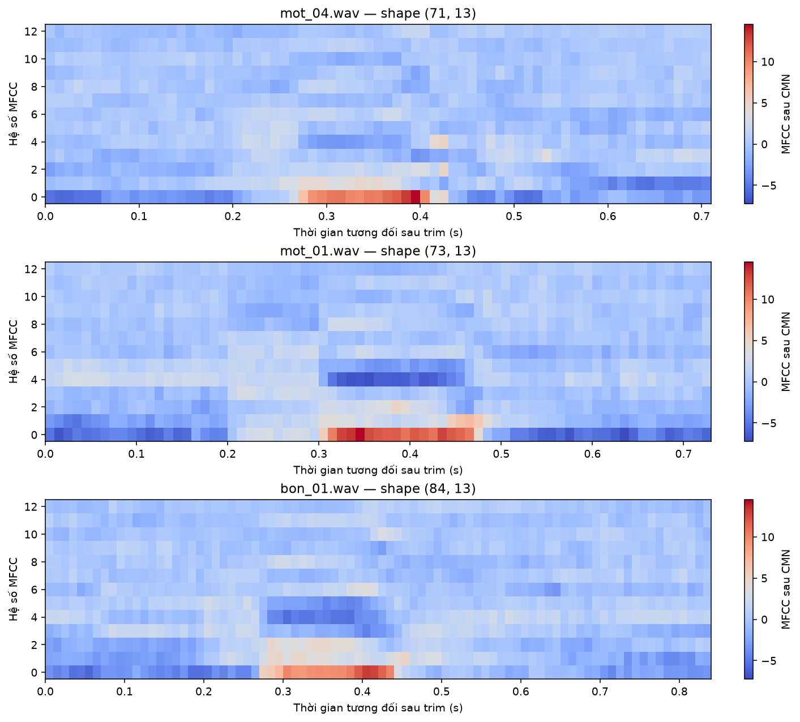

*Hình 13. Heatmap MFCC của các tệp mot_04.wav, mot_01.wav, bon_01.wav; mỗi frame có 13 hệ số và đã chuẩn hóa trung bình cepstral (CMN). Trục ngang là thời gian tương đối sau trim (s), trục dọc là chỉ số hệ số; các panel dùng chung thang màu.*

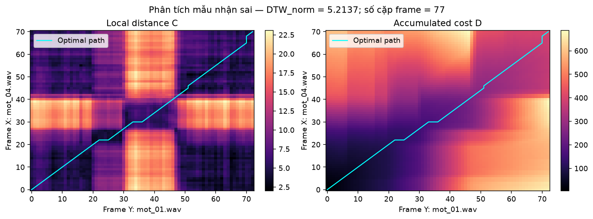

*Hình 14. Hai lần nói cùng từ: căn chỉnh DTW giữa mot_04.wav và mot_01.wav; panel trái là ma trận khoảng cách Euclid cục bộ C, panel phải là chi phí tích lũy D. Đường xanh cyan là đường đi tối ưu; trục ngang là chỉ số frame Y, trục dọc là chỉ số frame X. DTW_norm và số cặp frame trên đường đi được ghi trên hình.*

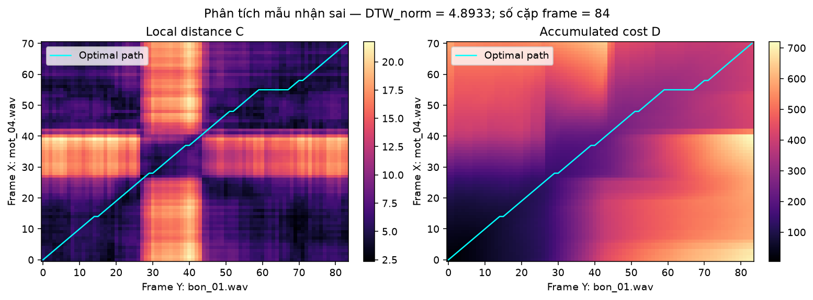

*Hình 15. Hai từ khác nhau: căn chỉnh DTW giữa mot_04.wav và bon_01.wav; panel trái là ma trận khoảng cách Euclid cục bộ C, panel phải là chi phí tích lũy D. Đường xanh cyan là đường đi tối ưu; trục ngang là chỉ số frame Y, trục dọc là chỉ số frame X. DTW_norm và số cặp frame trên đường đi được ghi trên hình.*

## 6. Trả lời câu hỏi báo cáo

1. Waveform nhạy với pha, tốc độ nói và số mẫu. MFCC mô tả đường bao phổ; DTW căn chỉnh chuỗi frame có độ dài khác nhau, phù hợp hơn so khớp mẫu thô.

2. Energy xác định vùng có mức tín hiệu đáng kể; ZCR hỗ trợ phân biệt hữu thanh/vô thanh và xem xét phụ âm yếu ở biên. Nhiễu có thể có ZCR cao nên cần phối hợp và nghe kiểm tra.

3. Thang Mel có độ dốc giảm khi Hz tăng; các điểm cách đều theo Mel sẽ cách xa hơn theo Hz ở vùng tần số cao.

4. Log nén dynamic range và biến quan hệ nhân thành cộng. DCT biểu diễn log-energy Mel bằng các hệ số cepstral; hệ số thấp mô tả biến thiên phổ chậm/đường bao phổ.

5. Với trục ngang Y và dọc X: bước ngang giữ frame X, tiến Y; bước dọc tiến X, giữ Y; bước chéo tiến cả hai. Các bước cho phép một frame ghép nhiều frame chuỗi kia.

6. Tổng cost thường tăng khi path dài. Chia path length giảm thiên lệch chiều dài; đây là chuẩn hóa sau khi tối ưu tổng, không phải tối ưu cost trung bình.

7. Tốc độ/phát âm, pitch và trạng thái giọng, mức âm lượng/khoảng cách micro, tiếng ồn/kênh thu, và vị trí biên trim đều có thể làm MFCC thay đổi.

8. Xem cặp nhầm ở mục 5. Kiểm tra audio và hình trước khi quy nguyên nhân; nếu không có lỗi thì báo không có cặp nhầm trên tập hiện tại, không tự tạo kết luận.

9. Template ít người không bao phủ biến thiên người nói. HMM và mô hình âm học được huấn luyện trên dữ liệu nhiều người có thể mô hình hóa biến thiên theo thời gian và người nói tốt hơn; hiệu quả còn phụ thuộc dữ liệu huấn luyện.

## 7. Giới hạn và việc cần hoàn thiện

Chưa có thí nghiệm cross-speaker, chưa hiệu chỉnh ngưỡng reject. Endpoint giả định 200 ms đầu/cuối chủ yếu là nền, và một file có một từ. Tiếng người khác kéo dài hoặc nền thay đổi đột ngột vẫn có thể làm sai biên. Chỉ chọn tham số trên train/validation; giữ test làm đánh giá cuối. Trước khi nộp cần nghe biên trim và bổ sung mô tả thu âm.
